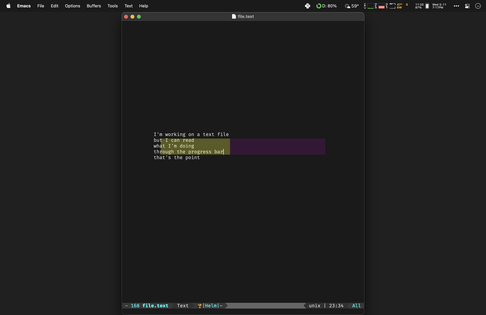
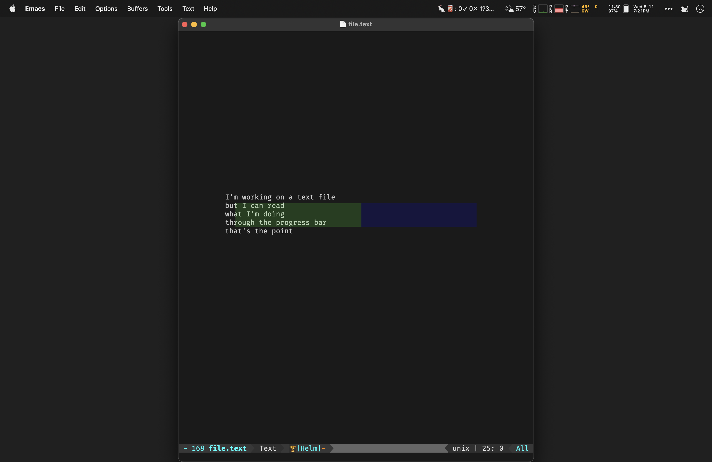
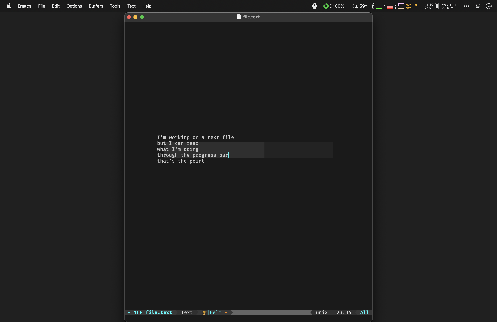
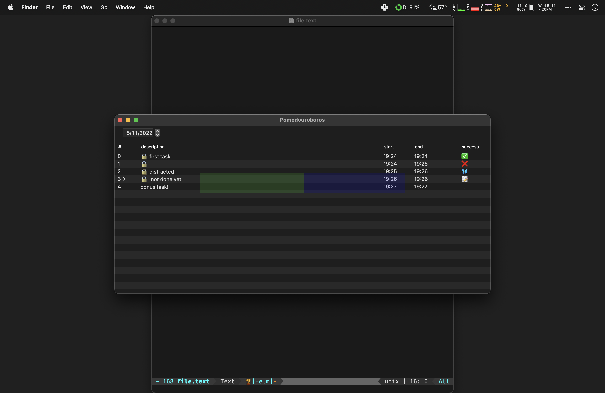

# Pomodouroboros

Most pomodoro trackers assume you're going to start them. But time and tide
wait for no one - the great pomodoro of the cosmos is cold and dark, and it
goes on forever.

For people with ADHD or other executive function disorders, time blindness is
common; the inability to notice that time is passing or initiate tasks at an
appropriate time.  It's easy to let half the day slip by before starting your
first pomodoro.

Pomodouroboros's goal is to:

1. stay constantly in your visual field so that you will ABSOLUTELY not forget
   to set some goals
2. remind you that death stalks your every step, and the pomodoros are
   happening whether you're making use of them or not

The way it accomplishes this is to have a pre-existing schedule, where the
pomodoros are always running, whether you've said what you're going to do with
them or not.  There's a progress bar in the middle of your screen showing the
progress of the current one on your main display, in different colors depending
on whether you haven't set an intention yet:

If you *have* set one for the current block:

Or if you're taking a break:

You can also list the pomodoros in the current day (shown here in “test” mode,
which lets you experiment with a very short “day” that progresses rapidly while
developing the app):

The status item in the menu bar shows 4 items:

- A 🍅 (if your intentionality exceeds your distraction) or 🥫 (if you are
  mostly distracted).  The point is to get the fresh tomato!
- A number before a “✓” indicating how many “success points” you’ve got for the
  current day, gained by focused or successful pomodoros, and for setting
  intentions
- A number before a “✕” indicating how many “distraction points” you’ve got for
  the current day
- A number before a “?” indicating how many completed or in-progress pomodoros
  that you can currently evaluate for success.
- A number before a “…” indicating how many pomodoros remain before the end of
  the day.

## Status

Currently, Pomodouroboros's implementation quality is very rough, and probably
not suitable for anyone other than people who know, or want to learn, Python,
in order to help fix it up.  As such there is no packaged build for end-users
yet.  However, hopefully in the [not too distant
future](https://github.com/glyph/Pomodouroboros/issues/21), releases will be
available from the "Releases" tab.
