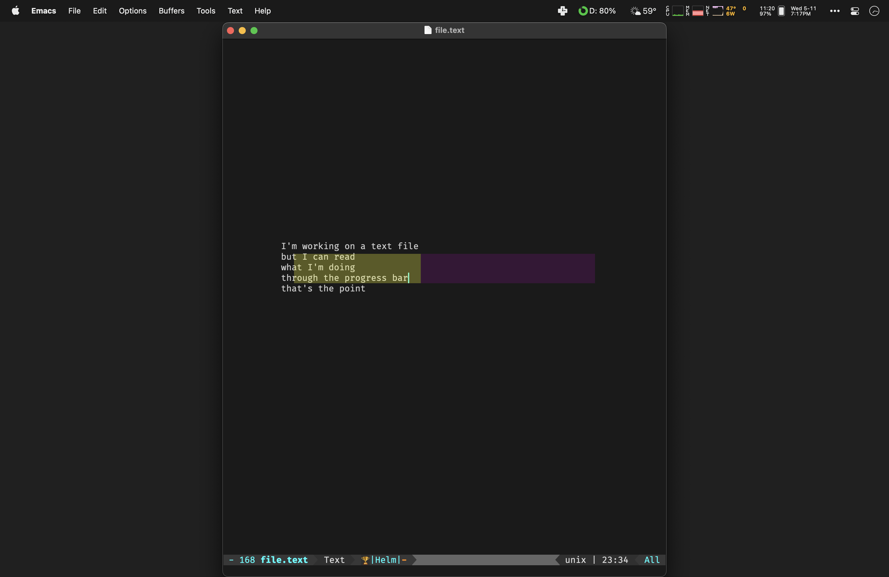
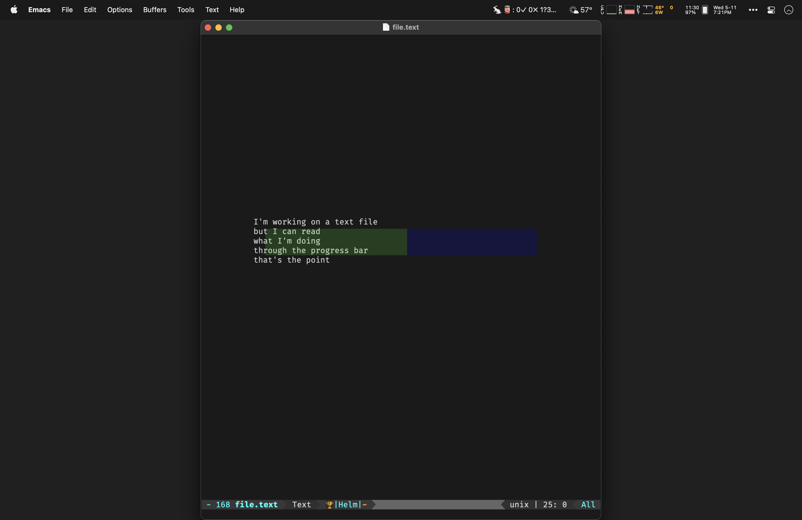
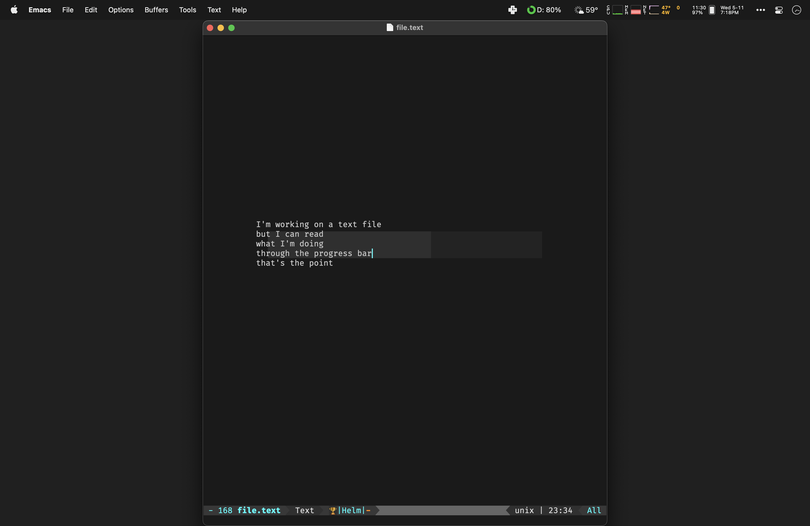
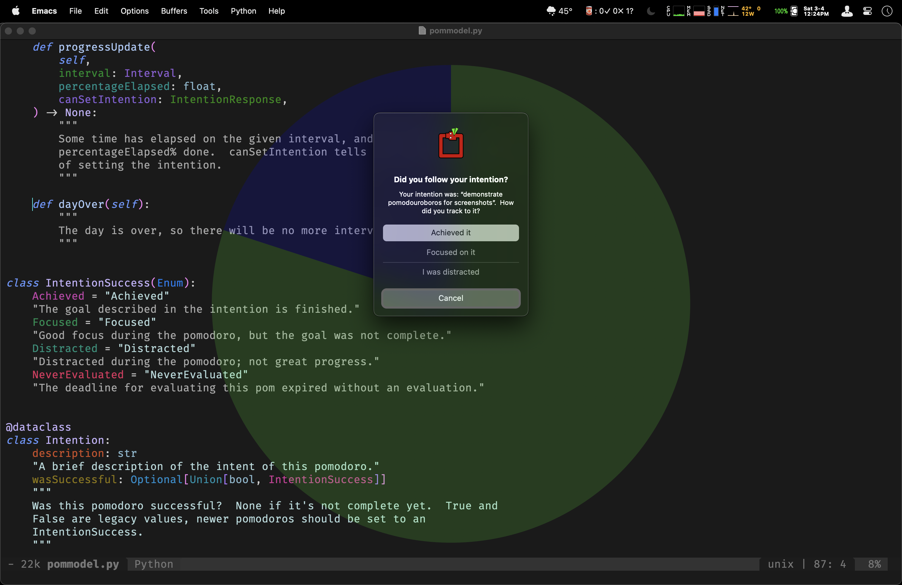
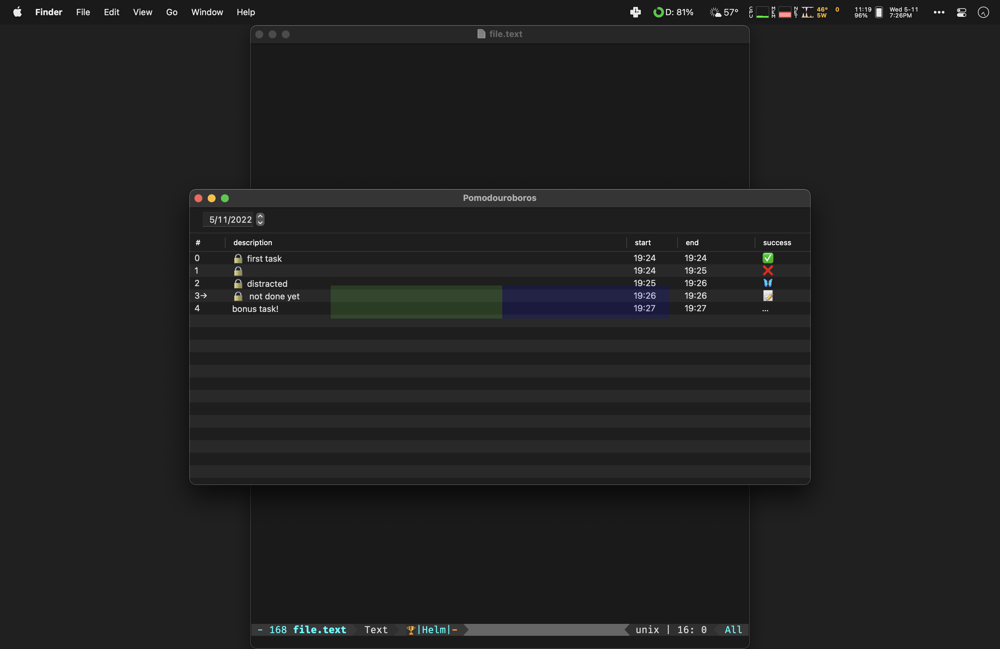

# Pomodouroboros

Most pomodoro trackers assume you’re going to start them. But time and tide
wait for no one - the great pomodoro of the cosmos is cold and dark, and it
goes on forever.

For people with ADHD or other executive function disorders, time blindness is
common; the inability to notice that time is passing or initiate tasks at an
appropriate time.  It’s easy to let half the day slip by before starting your
first pomodoro.

Pomodouroboros’s goal is to:

1. stay constantly in your visual field so that you will ABSOLUTELY not forget
   to set some goals
2. remind you that death stalks your every step, and the pomodoros are
   happening whether you’re making use of them or not

The way it accomplishes this is to have a pre-existing schedule, where the
pomodoros are always running, whether you’ve said what you’re going to do with
them or not.  There’s a large, transparent progress pie-chart in the middle of
your screen showing the progress of the current one on all displays, in
different colors depending on whether you haven’t set an intention yet:

If you *have* set one for the current block:

Or if you’re taking a break:

If you successfully set an intention, you can evaluate the pomodoro afterwards:

You can also list the pomodoros in the current day (shown here in “test” mode,
which lets you experiment with a very short “day” that progresses rapidly while
developing the app):

The status item in the menu bar shows 4 items:

- A 🍅 (if your intentionality exceeds your distraction) or 🥫 (if you are
  mostly distracted).  The point is to get the fresh tomato!
- A number before a “✓” indicating how many “success points” you’ve got for the
  current day, gained by focused or successful pomodoros, and for setting
  intentions
- A number before a “✕” indicating how many “distraction points” you’ve got for
  the current day
- A number before a “?” indicating how many completed or in-progress pomodoros
  that you can currently evaluate for success.
- A number before a “…” indicating how many pomodoros remain before the end of
  the day.

## Status

Currently, Pomodouroboros’s implementation quality is very rough, and probably
not suitable for anyone other than people who know, or want to learn, Python,
in order to help fix it up.  As such there is no packaged build for end-users
yet.  However, hopefully in the [not too distant
future](https://github.com/glyph/Pomodouroboros/issues/21), releases will be
available from the “Releases” tab.

Right now there’s only a Mac frontend since that’s the platform I use
day-to-day, but I’d really like to get Windows and Linux frontends as soon as
possible.

If “person with ADHD who knows or wants to learn Python” sounds like you, have
a look at the [list of issues](https://github.com/glyph/Pomodouroboros/issues)
to find something simple to contribute!  In order to run it, make sure you have
Xcode installed (like [actual, for-real
Xcode](https://apps.apple.com/us/app/xcode/id497799835?mt=12), not the
command-line tools; this is a GUI, not a command-line thing, so you need the
GUI development tools) make a virtualenv however you prefer to do that, run
`./mac-dev-install`, and then run `./runme`.

Note that if you really want to keep using the app, `./testme` creates a
different test bundle so you can run through some quick, fake test pomodoros
without conflicting with the real-time instance that you're using.

## Troubleshooting `./mac-dev-install` / `./runme`

`./runme` builds a real, signed `.app` bundle via `py2app`/`encrust`, so it's
fussier about your Python install than a typical virtualenv workflow. A few
gotchas if it doesn't work out of the box:

- **`AttributeError: module 'zlib' has no attribute '__file__'` during
  `encrust build`.** This means your virtualenv's Python has `zlib` (and
  probably other stdlib extension modules) statically linked into the
  interpreter instead of built as a separate shared object — for example a
  `uv`-managed "standalone" CPython build. `py2app` needs to copy `zlib`'s
  file, so it can't package a build made from this kind of interpreter. Fix:
  make the venv from a regular framework/shared build of Python instead (e.g.
  a python.org installer, or `pyenv install 3.13.x` without
  `PYTHON_CONFIGURE_OPTS` that disable shared extensions), and re-run
  `./mac-dev-install` with that interpreter active.

- **`codesign` fails with a `TypeError`/`RuntimeError` about `None`, or
  `encrust build` can't find a signing identity.** `encrust` reads
  `~/.encrust.json` for its Apple code-signing identity. If you don't have an
  Apple Developer Program membership and a "Developer ID Application"
  certificate installed (check with `security find-identity -v -p
  codesigning`), that file's `identity` field will be `null`, which breaks the
  `codesign --sign <identity>` call. For local development only (no
  notarization, not for distribution), set it to ad-hoc signing instead:
  `{"identity": "-", "profile": null, "appleID": null, "teamID": null}`.

- **App fails to launch with `dlopen(...): ... not valid for use in process:
  mapping process and mapped file (non-platform) have different Team IDs`.**
  This happens when using ad-hoc signing (see above) together with Hardened
  Runtime (`--options runtime`, which `encrust` always passes): macOS treats
  every ad-hoc signature as a distinct identity, so Library Validation blocks
  the main executable from loading the bundled `Python.framework` even though
  both show `TeamIdentifier=not set`. For local ad-hoc builds, add
  `com.apple.security.cs.disable-library-validation` (`true`) next to
  `com.apple.security.cs.allow-unsigned-executable-memory` in the entitlements
  plist `encrust` uses (`required-python-entitlements.plist` in the
  `encrust` package itself — this isn't currently configurable from
  `encrust_setup.py`). A real Developer ID certificate (see above) avoids
  needing this entirely, since then every file shares the same real Team ID.
